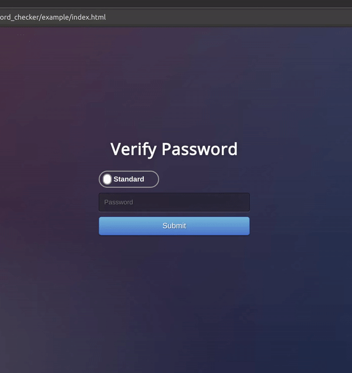

# Password_verification_tool

A tool for verifying the strength of passwords.

# Features

* Takes into account type of user (stricter requirements for admin users)
* Checks password too short
* Checks password contains the required characters
* Outputs what requirement is not being met if password is not valid

## Dependencies

mocha@8.3.2

## Installation


```bash
$ git clone https://github.com/kito-m/Password_verification_tool.git
$ npm init -y
```
* Open package.json and change value of scripts['test']
to "mocha --recursive --exit"

```
$ npm install mocha --save-dev
```

## Usage

#### JavaScript

```JavaScript
const checker = new PasswordChecker();
const password = document.getElementById('password');


function Submit(){
    submitBtn.addEventListener('click', () => {
        if (Admin_user == true){
            alert(checker.RunCheck(password.value, 'admin'))
        }
        else{
            alert(checker.RunCheck(password.value, 'normal'))
        }

    })
}
```
#### Python
```Python
from validate_password import PasswordChecker

Checker = PasswordChecker()

Checker.RunCheck("password123", "admin")

# returns a string either 'Password VALID' or 'Password NOT valid...'

```
## Testing
```
$ npm run test
```
```
$ cd python_check
$ python test_validate_password.py
```

## Example

 / ! [](passChecker.gif)

## License
[MIT](https://choosealicense.com/licenses/mit/)
